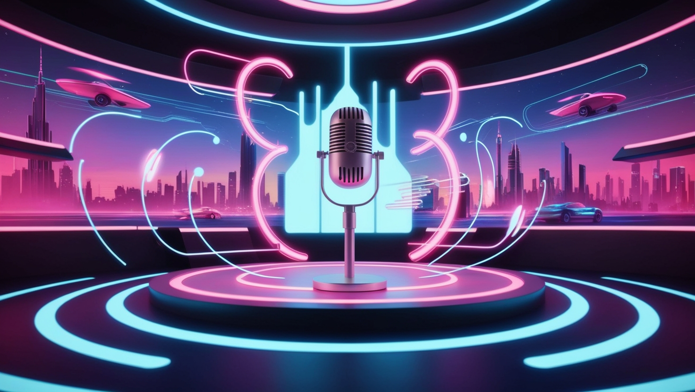
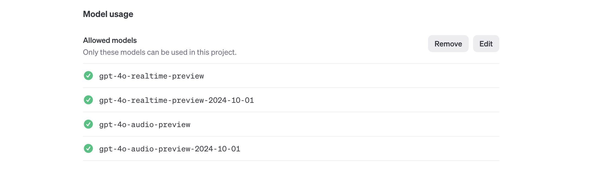

# Automated Speech Translation: Real-time Dubbing Powered by GPT-4o

## What This Blog is About

Real-time communication across languages is crucial in today’s interconnected world. Traditional translation and dubbing methods often fall short—they’re too slow, prone to errors, and struggle to scale effectively. However, advancements in AI have revolutionized audio translation, making it faster, more accurate, and seamlessly real-time.

This blog provides a step-by-step guide to building an automated real-time dubbing system. Using GPT-4o Realtime and GPT-4o Audio for context-aware audio translations, Node.js for data handling, and GridDB for scalable storage, you’ll learn how to process speech, translate it, and deliver dubbed audio instantly. If you’re ready to break language barriers with cutting-edge tech, let’s get started.

## Setting Up the Environment

### Prerequisites

This project demo run on the Node.js, GridDB database and you should have an access to the gpt-4o-realtime and gpt-4o-audio models. Optionally, you shuld give a permission for the demo app to use the microphone.

### Environment Setup

#### **OpenAI API Key**

You can create a new OpenAI project or use the existing one and then create and get the OpenAI API key [here](https://platform.openai.com/api-keys). Later, you need to save this key in the `.env` file.

By default, OpenAI will restrict the models from public access even if you have a valid key. You also need to enable these models in the OpenAI project settings:

## Capturing Speech Input

The speech input is from a microphone that accesible using the app via the browser.

## Transcribe Speech to Text

## Speech Dubbing

## Transcribe Benchmarking

## Quality Improvement

## Testing and Improvement
