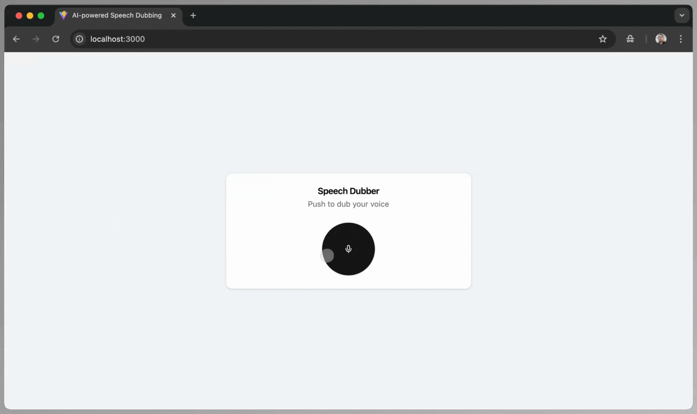
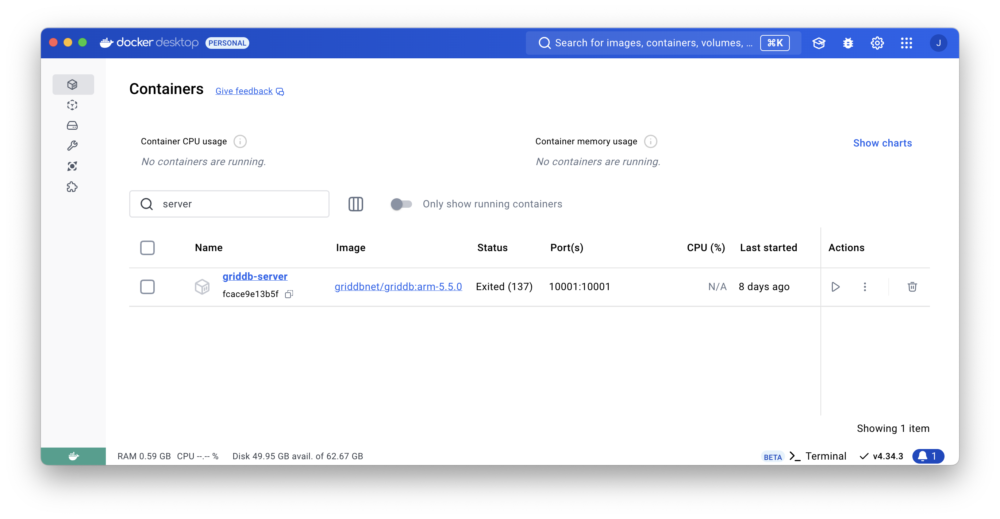

# Automated Speech Translation: Real-time Dubbing Powered by GPT-4o and Node.js


## What This Blog is About

Real-time communication across languages is crucial in today’s interconnected world. Traditional translation and dubbing methods often fall short—they’re too slow, prone to errors, and struggle to scale effectively. However, advancements in AI have revolutionized audio translation, making it faster, more accurate, and seamlessly real-time.

This blog provides a step-by-step guide to building an automated real-time dubbing system. Using GPT-4o Realtime and GPT-4o Audio for context-aware audio translations, Node.js for data handling, and GridDB for scalable storage, you’ll learn how to process speech, translate it, and deliver dubbed audio instantly. If you’re ready to break language barriers with cutting-edge tech, let’s get started.

## Prerequisites

You should have an access to the GPT-4o Realtime and GPT-4o Audio models. Also, you should give a permission for the app to use the microphone in the browser.

## How to Run the App

This app is tested on ARM Machines such as Apple MacBook M1 or M2 and to run the project you need the [Docker](https://www.docker.com/products/docker-desktop/) installed.

### 1.`.env` Setup

Create an empty directory, for example, `speech-dubbing`, and change to that directory:

```shell
mkdir speech-dubbing
cd speech-dubbing
```

Create a `.env` file with these keys:

```ini
OPENAI_API_KEY=
GRIDDB_CLUSTER_NAME=myCluster
GRIDDB_USERNAME=admin
GRIDDB_PASSWORD=admin
IP_NOTIFICATION_MEMBER=griddb-server:10001
VITE_APP_BASE_URL=http://localhost
VITE_PORT=3000
```

To get the `OPENAI_API_KEY` please read this [section](#openai-api-key).

### 2. Docker Compose Configuration

Before run the app create a `docker-compose.yml` file with this configuration settings:

```yaml
networks:
  griddb-net:
    driver: bridge

services:
  griddb-server:
    image: griddbnet/griddb:arm-5.5.0
    container_name: griddb-server
    environment:
      - GRIDDB_CLUSTER_NAME=${GRIDDB_CLUSTER_NAME}
      - GRIDDB_PASSWORD=${GRIDDB_PASSWORD}
      - GRIDDB_USERNAME=${GRIDDB_USERNAME}
      - NOTIFICATION_MEMBER=1
      - IP_NOTIFICATION_MEMBER=${IP_NOTIFICATION_MEMBER}
    networks:
      - griddb-net
    ports:
      - "10001:10001"

  clothes-rag:
    image: junwatu/speech-dubber:1.1
    container_name: speech-dubber-griddb
    env_file: .env 
    networks:
      - griddb-net
    ports:
      - "3000:3000"
```

### 3. Run

When steps 1 and 2 are finished, run the app with this command:

```shell
docker-compose up -d
```

If everything running, you will get a similar response to this:

```shell
[+] Running 3/3
 ✔ Network tmp_griddb-net          Created                                                0.0s 
 ✔ Container speech-dubber-griddb  Started                                                0.2s 
 ✔ Container griddb-server         Started                                                0.2s
```

### 4. Test the App

Open the browser and go to `http://localhost:3000`.



## Environment Setup

### **OpenAI API Key**

You can create a new OpenAI project or use the existing one and then create and get the OpenAI API key [here](https://platform.openai.com/api-keys). Later, you need to save this key in the `.env` file.

By default, OpenAI will restrict the models from public access even if you have a valid key. You also need to enable these models in the OpenAI project settings:


### Docker

For easy development and distribution, this project uses a docker container to "package" the application. For easy Docker installation, use the [Docker Desktop](https://www.docker.com/products/docker-desktop/) tool.

#### GridDB Docker

This app needs a GridDB server and it should be running before the app. In this project, we will use the GridDB docker for ARM machines.  To test the GridDB on your local machine, you can run these docker commands:

```shell
docker network create griddb-net
docker pull griddbnet/griddb:arm-5.5.0
docker run --name griddb-server \
    --network griddb-net \
    -e GRIDDB_CLUSTER_NAME=myCluster \
    -e GRIDDB_PASSWORD=admin \
    -e NOTIFICATION_MEMBER=1 \
    -d -t griddbnet/griddb:arm-5.5.0
```

By using the Docker Desktop, you can easily check if the GridDB docker is running.



For more about GridDB docker for ARM, please check out this [blog](https://griddb.net/en/blog/griddb-on-arm-with-docker/).

## Capturing Speech Input

### Accessing the Microphone

To record audio, the first step is to access the user’s microphone. This is achieved using the `navigator.mediaDevices.getUserMedia` API.

```js
const stream = await navigator.mediaDevices.getUserMedia({ audio: true });

```

The code above will prompts the user for permission to access the microphone.

### Recording Audio

Once microphone access is granted, the `MediaRecorder` API is used to handle the actual recording process. The audio stream is passed to `MediaRecorder` to create a recorder instance:

```js
mediaRecorderRef.current = new MediaRecorder(stream);
```

As the recording progresses, audio chunks are collected through the ondataavailable event:

```js
mediaRecorderRef.current.ondataavailable = (event: BlobEvent) => {
    audioChunksRef.current.push(event.data);
};
```

When the recording stops (`onstop` event), the chunks are combined into a single audio file (a `Blob`) and made available for upload:

```js
mediaRecorderRef.current.onstop = () => {
    const audioBlob = new Blob(audioChunksRef.current, { type: 'audio/wav' });
    const audioUrl = URL.createObjectURL(audioBlob);
    setAudioURL(audioUrl);
    audioChunksRef.current = [];
    uploadAudio(audioBlob);
};
```

The `uploadAudio` function will upload the audio blob into the Node.js server.

## Node.js Server

This Node.js server processes audio files by converting them to MP3, translating the audio content using OpenAI, and storing the data in a GridDB database. It provides endpoints for uploading audio files, querying data from the database, and serving static files.

### Routes Table

Here’s a summary of the endpoints available in this server:

| **Method** | **Endpoint**       | **Description**                                                                 |
|------------|--------------------|---------------------------------------------------------------------------------|
| `GET`      | `/`                | Serves the main HTML file (`index.html`).                                       |
| `POST`     | `/upload-audio`    | Accepts an audio file upload, converts it to MP3, processes it using OpenAI, and saves data to GridDB. |
| `GET`      | `/query`           | Retrieves all records from the GridDB database.                                |
| `GET`      | `/query/:id`       | Retrieves a specific record by ID from the GridDB database.                    |

## Speech Dubbing

The `gpt-4o-audio-preview` model from OpenAI will translate the recorded audio content into another language. Note that this model requires audio in base64-encoded format.

```js
const audioBuffer = fs.readFileSync(mp3FilePath);
const base64str = Buffer.from(audioBuffer).toString('base64');
```

The default language for the audio translation is "Japanese". However, you can change it in the source code or add UI for language selector for further enhancement.

```js
const language = "Japanese";

// Process audio using OpenAI
const result = await processAudio(base64str, language);
```

The response `result` of the `processAudio` function is in JSON format that contains this data:

```json
{
    "language": "Japanese",
    "filename": "translation-Japanese.mp3",
    "result": {
        "index": 0,
        "message": {
            "role": "assistant",
            "content": null,
            "refusal": null,
            "audio": {
                "id": "audio_6758f02de0b48190ba109885b931122c",
                "data": "base64-encoded_audio",
                "expires_at": 1733885501,
                "transcript": "こんにちは。今朝はとても晴天です。"
            }
        },
        "finish_reason": "stop"
    }
}
```

This JSON data is sent to the client, and with React, we can use it to render components, such as the HTML5 audio element, to play the translated audio.

## Save Audio Data into the GridDB


## Testing and Improvement
