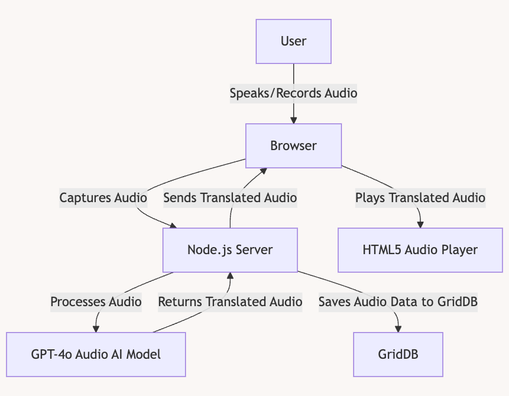
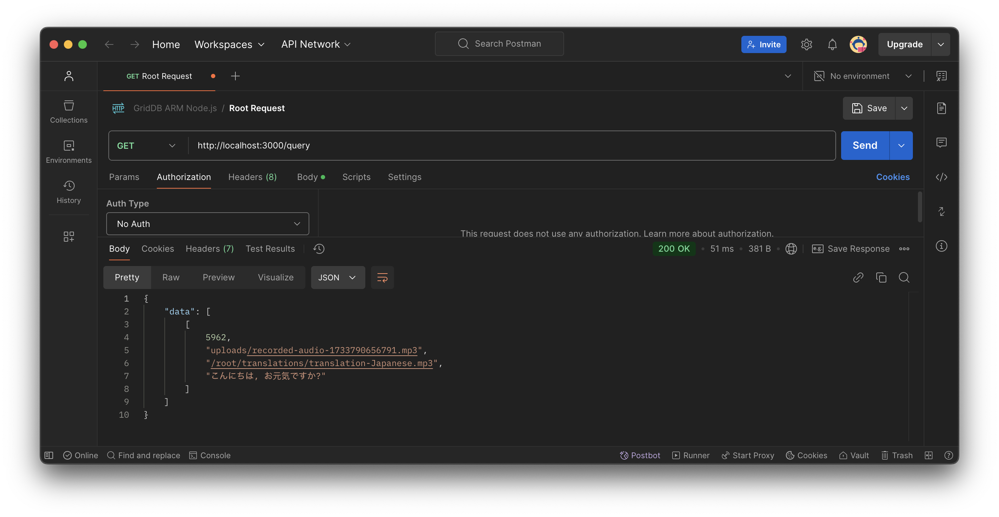
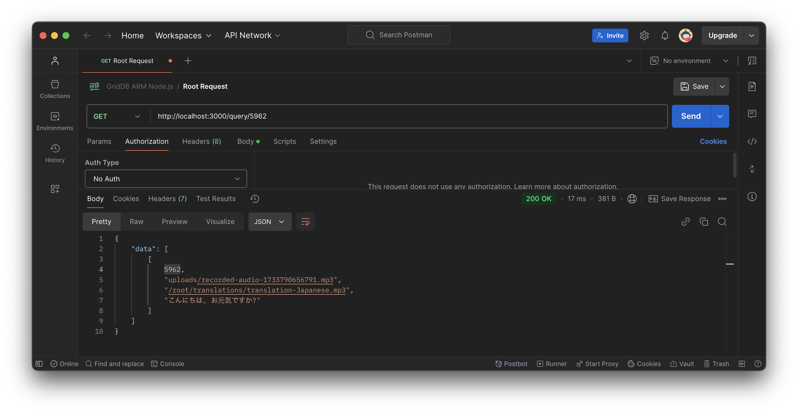
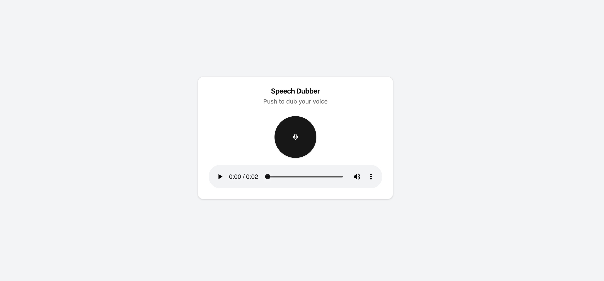

# Automated Speech Dubbing Using GPT-4o Audio and Node.js


## What This Blog is About

Easy communication across languages is crucial in today’s interconnected world. Traditional translation and dubbing methods often fall short—they’re too slow, prone to errors, and struggle to scale effectively. For instance, human-based translation can introduce subjective inaccuracies, while manual dubbing processes frequently fail to keep pace with real-time demands or large-scale projects. However, advancements in AI have revolutionized audio translation, making it faster and more accurate.

This blog provides a step-by-step guide to building an automated dubbing system. Using GPT-4o Audio for context-aware audio translations, Node.js for data handling, and GridDB for scalable storage, you’ll learn how to process speech, translate it, and deliver dubbed audio instantly. This guide will explain how to automate speech dubbing, ensuring seamless communication across languages, and the term "speech" is used interchangeably with "audio."

## Prerequisites

You should have access to the [GPT-4o Audio](https://platform.openai.com/docs/models#gpt-4o-realtime) models. Also, you should give the app permission to use the microphone in the browser.

## How to Run the App

The source code for this project is available in this [repository](https://github.com/junwatu/speech-dubbing-griddb). You don't need to clone it to run the app, as the working application is already dockerized. However, to run the project you need the [Docker](https://www.docker.com/products/docker-desktop/) installed.

Please note, that this app is tested on ARM machines such as Apple MacBook M1 or M2. While it is optimized for ARM architecture, it possible run on non-ARM machines with minor modifications, such as using a different GridDB Docker image for x86 systems.

### 1.`.env` Setup

Create an empty directory, for example, `speech-dubbing`, and change to that directory:

```shell
mkdir speech-dubbing
cd speech-dubbing
```

Create a `.env` file with these keys:

```ini
OPENAI_API_KEY=
GRIDDB_CLUSTER_NAME=myCluster
GRIDDB_USERNAME=admin
GRIDDB_PASSWORD=admin
IP_NOTIFICATION_MEMBER=griddb-server:10001
VITE_APP_BASE_URL=http://localhost
VITE_PORT=3000
```

To get the `OPENAI_API_KEY` please read this [section](#openai-api-key).

### 2. Docker Compose Configuration

Before run the app create a `docker-compose.yml` file with this configuration settings:

```yaml
networks:
  griddb-net:
    driver: bridge

services:
  griddb-server:
    image: griddbnet/griddb:arm-5.5.0
    container_name: griddb-server
    environment:
      - GRIDDB_CLUSTER_NAME=${GRIDDB_CLUSTER_NAME}
      - GRIDDB_PASSWORD=${GRIDDB_PASSWORD}
      - GRIDDB_USERNAME=${GRIDDB_USERNAME}
      - NOTIFICATION_MEMBER=1
      - IP_NOTIFICATION_MEMBER=${IP_NOTIFICATION_MEMBER}
    networks:
      - griddb-net
    ports:
      - "10001:10001"

  clothes-rag:
    image: junwatu/speech-dubber:1.2
    container_name: speech-dubber-griddb
    env_file: .env 
    networks:
      - griddb-net
    ports:
      - "3000:3000"
```

### 3. Run

When steps 1 and 2 are finished, run the app with this command:

```shell
docker-compose up -d
```

If everything running, you will get a similar response to this:

```shell
[+] Running 3/3
 ✔ Network tmp_griddb-net          Created                                                0.0s 
 ✔ Container speech-dubber-griddb  Started                                                0.2s 
 ✔ Container griddb-server         Started                                                0.2s
```

### 4. Test the Speech Dubber App

These are the steps to use the app:

 1. **Open the App**: Open your browser and navigate to [http://localhost:3000](http://localhost:3000).
 2. **Start Recording**: Click the record button.
 3. **Allow Microphone Access**: When prompted by the browser, click “Allow this time.”
 4. **Speak**: Record your message in English.
 5. **Stop Recording**: Click the stop button when done. Wait while the app processes and translates your audio.
 6. **Play the Translation**: Use the playback controls to listen to the translated Japanese audio.

The demo below summarizes all the steps:

 

## Environment Setup

### **OpenAI API Key**

You can create a new OpenAI project or use the existing one and then create and get the OpenAI API key [here](https://platform.openai.com/api-keys). Later, you need to save this key in the `.env` file.

By default, OpenAI will restrict the models from public access even if you have a valid key. You also need to enable these models in the OpenAI project settings:


### Docker

For easy development and distribution, this project uses a docker container to "package" the application. For easy Docker installation, use the [Docker Desktop](https://www.docker.com/products/docker-desktop/) tool.

#### GridDB Docker

This app needs a GridDB server and it should be running before the app. In this project, we will use the GridDB docker for ARM machines.  To test the GridDB on your local machine, you can run these docker commands:

```shell
docker network create griddb-net
docker pull griddbnet/griddb:arm-5.5.0
docker run --name griddb-server \
 --network griddb-net \
    -e GRIDDB_CLUSTER_NAME=myCluster \
 -e GRIDDB_PASSWORD=admin \
    -e NOTIFICATION_MEMBER=1 \
 -d -t griddbnet/griddb:arm-5.5.0
```

By using the Docker Desktop, you can easily check if the GridDB docker is running.


For more about GridDB docker for ARM, please check out this [blog](https://griddb.net/en/blog/griddb-on-arm-with-docker/).

### Development

If you are a curious developer or need further development, you can clone and examine the [project source code]((https://github.com/junwatu/speech-dubbing-griddb)). Primarily, you must have Node.js, FFmpeg, and GridDB installed on your system.

## System Architecture



The flow of the speech dubbing process is pretty simple: The process begins with the user speaking into the browser, which captures the audio. This recorded audio is then sent to the Node.js server, where it undergoes processing. The server calls the GPT-4o Audio model to translate the audio content into another language. Once the audio is translated, the server saves the original and translated audio, along with relevant metadata, to the GridDB database for storage.

Finally, the translated audio is sent back to the browser, where the user can play it through an HTML5 audio player.

## Capturing Speech Input

### Accessing the Microphone

To record audio, the first step is to access the user’s microphone. This is achieved using the `navigator.mediaDevices.getUserMedia` API.

```js
const stream = await navigator.mediaDevices.getUserMedia({ audio: true });

```

The code above will prompt the user for permission to access the microphone.

### Recording Audio

Once microphone access is granted, the `MediaRecorder` API is used to handle the actual recording process. The audio stream is passed to `MediaRecorder` to create a recorder instance:

```js
mediaRecorderRef.current = new MediaRecorder(stream);
```

As the recording progresses, audio chunks are collected through the `ondataavailable` event:

```js
mediaRecorderRef.current.ondataavailable = (event: BlobEvent) => {
    audioChunksRef.current.push(event.data);
};
```

When the recording stops (`onstop` event), the chunks are combined into a single audio file (a `Blob`) and made available for upload:

```js
mediaRecorderRef.current.onstop = () => {
    const audioBlob = new Blob(audioChunksRef.current, { type: 'audio/wav' });
    const audioUrl = URL.createObjectURL(audioBlob);
    setAudioURL(audioUrl);
    audioChunksRef.current = [];
    uploadAudio(audioBlob);
};
```

The `uploadAudio` function will upload the audio blob into the Node.js server.

## Node.js Server

This Node.js server processes audio files by converting them to MP3, translating the audio content using OpenAI, and storing the data in a GridDB database. It provides endpoints for uploading audio files, querying data from the database, and serving static files.

### Routes Table

Here’s a summary of the endpoints or API available in this server:

| **Method** | **Endpoint**       | **Description**                                                                 |
|------------|--------------------|---------------------------------------------------------------------------------|
| `GET`      | `/`                | Serves the main HTML file (`index.html`).                                       |
| `POST`     | `/upload-audio`    | Accepts an audio file upload, converts it to MP3, processes it using OpenAI, and saves data to GridDB. |
| `GET`      | `/query`           | Retrieves all records from the GridDB database.                                |
| `GET`      | `/query/:id`       | Retrieves a specific record by ID from the GridDB database.                    |

## Audio Conversion

The default recording file format sent by the client is [WAV](https://en.wikipedia.org/wiki/WAV). However, in the Node.js server, this file is converted into the MP3 format for better processing.

The audio conversion is done by [fluent-ffmpeg](https://github.com/fluent-ffmpeg/node-fluent-ffmpeg) npm package:

```js
const convertToMp3 = () => {
   return new Promise((resolve, reject) => {
    ffmpeg(originalFilePath)
     .toFormat('mp3')
     .on('error', (err) => {
      console.error('Conversion error:', err);
      reject(err);
     })
     .on('end', () => {
      fs.unlinkSync(originalFilePath);
      resolve(mp3FilePath);
     })
     .save(mp3FilePath);
   });
  };
```

If you want to develop this project for further enhancements, you need to install [ffmpeg](https://www.ffmpeg.org/) in your system.

## Speech Dubbing

### Target Language

The `gpt-4o-audio-preview` model from OpenAI will translate the recorded audio content into another language.

```js
const audioBuffer = fs.readFileSync(mp3FilePath);
```

Note that this model requires audio in base64-encoded format, so you have to encode the audio content into the base 64:

```js
const base64str = Buffer.from(audioBuffer).toString('base64');
```

The default language for the audio translation is "Japanese". However, you can change it in the source code or add UI for language selector for further enhancement.

```js
const language = "Japanese";

// Process audio using OpenAI
const result = await processAudio(base64str, language);
```

The response `result` of the `processAudio` function is in JSON format that contains this data:

```json
{
    "language": "Japanese",
    "filename": "translation-Japanese.mp3",
    "result": {
        "index": 0,
        "message": {
            "role": "assistant",
            "content": null,
            "refusal": null,
            "audio": {
                "id": "audio_6758f02de0b48190ba109885b931122c",
                "data": "base64-encoded_audio",
                "expires_at": 1733885501,
                "transcript": "こんにちは。今朝はとても晴天です。"
            }
        },
        "finish_reason": "stop"
    }
}
```

This JSON data is sent to the client, and with React, we can use it to render components, such as the HTML5 audio element, to play the translated audio.

## GPT-4o Audio

The [gpt-4o-audio](https://platform.openai.com/docs/models#gpt-4o-realtime) model is capable of [generating audio](https://platform.openai.com/docs/guides/audio) and text response based on the audio input. The model response is controlled by the system and user prompts. However, this project only uses the system prompt:

```js
{
  role: "system",
  content: `The user will provide an English audio. Dub the complete audio, word for word in ${language}. Keep certain words in original language for which a direct translation in ${language} does not exist.`
},
```

The response type, text or audio is set by the `modalities` parameter, and the audio voice is set by the `audio` parameter:

```js
export async function processAudio(base64Str, language) {
 try {
  const response = await openai.chat.completions.create({
 model: "gpt-4o-audio-preview",
 modalities: ["text", "audio"],
 audio: { voice: "alloy", format: "mp3" },
 messages: [
    {
 role: "system",
 content: `The user will provide an English audio. Dub the complete audio, word for word in ${language}. Keep certain words in original language for which a direct translation in ${language} does not exist.`
    },
    {
 role: "user",
 content: [
      {
 type: "input_audio",
 input_audio: {
 data: base64Str,
 format: "mp3"
       }
      }
 ]
    }
 ],
  });

  return response.choices[0];
 } catch (error) {
  throw new Error(`OpenAI audio processing failed: ${error.message}`);
 }
}
```

## Save Audio Data

### Data Schema

To save audio data in the GridDB database, we must define the schema columns. The schema includes fields such as `id`, `originalAudio`, `targetAudio`, and `targetTranscription`.

The container name can be arbitrary; however, it is best practice to choose one that reflects the context. For this project, the container name is `SpeechDubbingContainer` :

```js
const containerName = 'SpeechDubbingContainer';
const columnInfoList = [
 ['id', griddb.Type.INTEGER],
 ['originalAudio', griddb.Type.STRING],
 ['targetAudio', griddb.Type.STRING],
 ['targetTranscription', griddb.Type.STRING],
];
const container = await getOrCreateContainer(containerName, columnInfoList);
```

This table explaining the schema defined in the selected portion of your code:

| **Column Name**         | **Type**               | **Description**                                                                                   |
|--------------------------|------------------------|---------------------------------------------------------------------------------------------------|
| `id`                    | `griddb.Type.INTEGER` | A unique identifier for each entry in the container.                                             |
| `originalAudio`         | `griddb.Type.STRING`  | The file path or name of the original audio file that was uploaded and processed.                |
| `targetAudio`           | `griddb.Type.STRING`  | The file path or name of the generated audio file containing the translated or dubbed speech.    |
| `targetTranscription`   | `griddb.Type.STRING`  | The text transcription of the translated audio, as provided by the speech processing API.        |

### Save Operation

If the audio translation succesful, the `insertData` function will save the audio data into the database.

```js
try {
  const container = await getOrCreateContainer(containerName, columnInfoList);
  await insertData(container, [generateRandomID(), mp3FilePath, targetAudio, result.message.audio.transcript]);
} catch (error) {
  console.log(error)
}
```

The GridDB data operation code is located in the `griddbOperations.js` file. This file provides detailed implementation on inserting data, querying data, and retrieving data by its ID in the GridDB database.

### Read Operation

To read all data or data for a specific ID, you can use code or tools like Postman. For example, to query all data in the GridDB database by using the `/query` endpoint:



And to read a specific data by ID, you can use the `/query/:id` endpoint:



## User Interface

The user interface in this project is build using React. The `AudioRecorder.tsx` is a React component for a speech dubbing interface featuring a header with a title and description, a recording alert, a toggleable recording button, and an audio player for playback if a translated audio URL is available:

```jsx
<Card className="w-full">
   <CardHeader className='text-center'>
    <CardTitle>Speech Dubber</CardTitle>
    <CardDescription>Push to dub your voice</CardDescription>
   </CardHeader>
   <CardContent className="space-y-4">
    {isRecording && (
     <Alert variant="destructive">
      <AlertDescription>Recording in progress...</AlertDescription>
     </Alert>
 )}

    <div className="flex justify-center">
     <Button
      onClick={toggleRecording}
      variant={isRecording ? "destructive" : "default"}
      className="w-24 h-24 rounded-full"
     >
      {isRecording ? <StopCircle size={36} /> : <Mic size={36} />}
     </Button>
    </div>

    {translatedAudioURL && (
     <div className="space-y-4">
      <audio
       src={translatedAudioURL}
       controls
       className="w-full"
      />
     </div>
 )}
   </CardContent>
  </Card>
```

This is the screenshot when the translated audio is available:



## Further Improvements

This blog teaches you how to build a simple web application that translates audio from one language to another. However, please note that this is just a prototype. There are several improvements that you can make. Here are some suggestions:

- Enhance the user interface.
- Add a real-time feature.
- Include a language selector.
- Implement user management.
